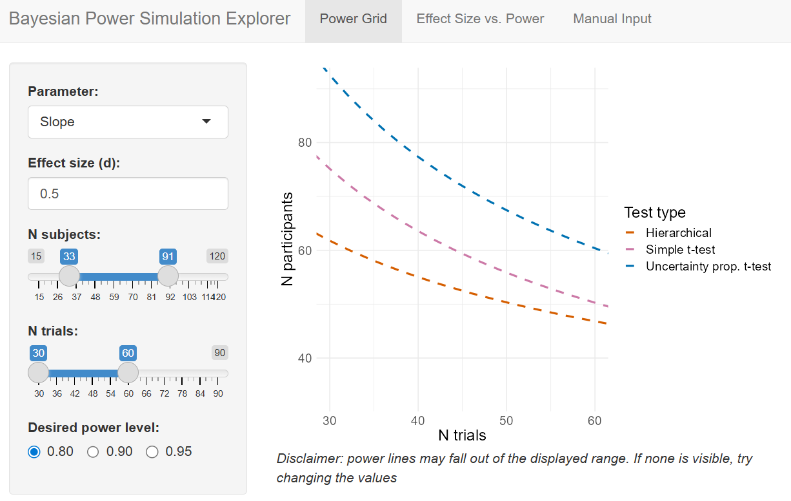

# Hierarchical-Interoception v0.9.0-beta

⚠️ **Pre-publication Release**: This is pre-peer-review research software. The methods and results are under review. Use with appropriate caution for research applications.

This repository is the companion of our pre-print "Hierarchical Bayesian Modelling of Interoceptive Psychophysics" (https://doi.org/10.1101/2025.08.27.672360).

In this pre-print, we introduce hierarchical psychometric function models for the analysis of interoceptive psychophysics data, more specifically for the Heart Rate Discrimination Task (HRDT) and Respiratory Resistance Sensitivity Task (RRST).
We validate these models (parameter and model recovery analysis), fit them to a large dataset to derive normative priors for simulations and future studies, and run a power analysis examining how different design and analysis choices influence our ability to reliably detect various effect sizes. 
All the data and codes used to prepare this manuscript are available on this repository.

In addition to the pre-print, we also provide ressources to facilitate the adoption of hierarchical modelling by researchers who work with HRDT or RRST data.
One of these is a R markdown file demonstrating how to implement and interpet these models, using the well documented BRMS library.
Another is a shiny app which researchers can use to explore the results of our power analysis, e.g. to justify sample size of future studies.

## Table of Contents
1. [Quick Start](#quick-start)
2. [Structure of the repository](#structure-of-the-repository)
3. [Using the BRMS Demo](#using-the-brms-demo)
4. [Shiny App Deployment and Usage](#shiny-app-deployment-and-usage)
5. [Dependencies](#dependencies)
6. [Citation](#citation)
7. [Contact](#contact)

## Quick Start

1. **Clone the repository**:
   ```bash
   git clone https://github.com/[username]/Hierarchical-Interoception.git
   cd Hierarchical-Interoception
   ```

2. **Set up the environment**:
   ```r
   # Run the setup script
   source("setup.R")
   ```

3. **Try the BRMS demo**:
   - Open `app & demo/BRMS demo.Rmd`
   - Run the code to see a complete analysis workflow

4. **Explore power analysis**:
   ```r
   shiny::runApp("app & demo/shiny app.R")
   ```

## Structure of the repository

```
Hierarchical-Interoception/
├── analysis/                    # Model comparison for the HRDT
├── app & demo/                  # BRMS demo and Shiny app
├── data/                        # Raw data files
├── figures/                     # Generated figures
├── figures_scripts/             # Figure generation scripts
├── results/                     # Analysis results and power analysis
├── scripts/                     # Utility functions and main scripts
├── simulated_data/              # Simulated datasets (model recovery and power analysis)
└── stanmodels/                  # Stan model definitions (VMP-data refit, poweranalysis and model recovery)
```

## Using the BRMS Demo

The `app & demo/BRMS demo.Rmd` provides a complete workflow for data simulation and analysis for both the HRDT and RRST, including:

1. **Data simulation**: Generate synthetic data with known parameters
2. **Model specification**: Define the hierarchical psychometric function
3. **Model fitting**: Fit using BRMS with Stan backend
4. **Model diagnostics**: Check convergence and sampling quality
5. **Model interpretation**: Extract posterior distributions and credible intervals
5. **Results reporting**: Sample text showing how one could report the results in a scientific paper
5. **Results visualization**: Generates a series of plots that can be added to a scientific manuscript to illustrate the results

The code can easily be recycled to analyze your own data.

## Shiny App Deployment and Usage

### App Overview

The Shiny app (`apps & wrappers/shiny app.R`) provides an interactive interface for exploring power analysis results with three main panels:

1. **Power Grid**: Visualize power contours across different sample sizes
2. **Effect Size vs. Power**: Examine power as a function of effect size
3. **Manual Input**: Get specific power estimates for custom parameters



### Deployment

#### Local Deployment

1. **Install Dependencies**:
```r
install.packages(c("shiny", "tidyverse", "flextable", "posterior"))
```

2. **Running the App**:
Either enter this in the R-console
```r
shiny::runApp("apps & wrappers/shiny app.R")
```
or go to the "app & demo" directory and run the `shiny app.R` script 

### App Usage

#### Power Grid Panel

1. **Parameter**: Choose between "Threshold" or "Slope"
2. **Effect Size**: Specify the desired effect size (0.0 to 1.0)
3. **Adjust Sample and trial Ranges**: Use sliders to set subject and trial ranges
4. **Choose Power Level**: Select desired power (0.80, 0.90, or 0.95)
5. **Interpret Results**: Contour lines show combinations achieving target power

#### Effect Size vs. Power Panel

1. **Parameter**: Choose between "Threshold" or "Slope"
2. **Set Sample Size**: Specify number of subjects and trials
3. **View Power Curve**: See how power changes with effect size
3. **Interpret Results**: Psychometric functions show (efffect size by power).

#### Manual Input Panel

1. **Enter Parameters**: Specify exact sample sizes and effect size and parameter
2. **Submit Query**: Get precise power estimates for above
3. **View Results**: See power for hierarchical, simple t-test, and uncertainty propagation methods

## Dependencies

### Stan Installation
```r
# Install cmdstanr
install.packages("cmdstanr", repos = c("https://mc-stan.org/r-packages/", getOption("repos")))

# Check cmdstan installation
cmdstanr::check_cmdstan_toolchain()
cmdstanr::install_cmdstan()
```

## Citation

If you use this code in your research, please cite:

```
Arthur S. Courtin, Jesper Fischer Ehmsen, Leah Banellis, Francesca Fardo, Micah Allen
bioRxiv 2025.08.27.672360; doi: https://doi.org/10.1101/2025.08.27.672360
```

## Contact

For questions or issues with this repository, please contact the authors or open an issue on the repository page.
